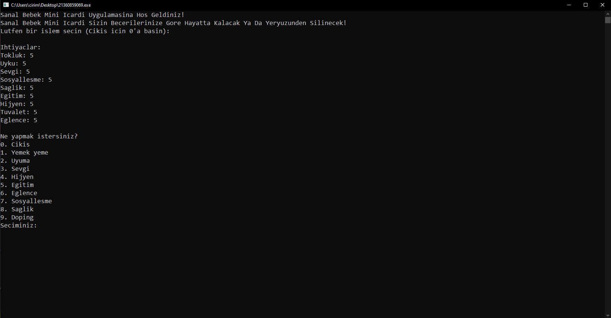

# Sanal Bebek Uygulaması

Bu proje, C dilinde geliştirilmiş bir **Sanal Bebek Uygulamasıdır**. Uygulama, çeşitli ihtiyaçları olan bir sanal bebeği simüle eder ve bu ihtiyaçları yöneterek bebeği hayatta tutmayı amaçlar.

## Özellikler
- **İhtiyaç Yönetimi:**
  - Tokluk
  - Uyku
  - Sevgi
  - Sosyalleşme
  - Sağlık
  - Eğitim
  - Hijyen
  - Tuvalet
  - Eğlence
- Her bir ihtiyaç, belirli fonksiyonlar kullanılarak iyileştirilebilir veya kötüleştirilebilir.

## Nasıl Çalışır?
Sanal bebeğin ihtiyaçlarını düzenleyen fonksiyonları çağırarak etkileşimde bulunabilirsiniz. Amacınız, bu ihtiyaçlar arasında bir denge sağlayarak bebeği sağlıklı ve mutlu tutmaktır.

## Gereksinimler
- Bir C derleyicisi (örn. GCC, Clang veya C'yi destekleyen herhangi bir IDE).

## Kurulum ve Çalıştırma
1. Bu depoyu klonlayın:
   ```bash
   git clone https://github.com/ncrim7/VirtualBaby.git
   ```
2. Proje dizinine gidin:
   ```bash
   cd VirtualBaby
   ```
3. Projeyi derleyin:
   ```bash
   gcc -o VirtualBaby virtual_baby.c
   ```
4. Uygulamayı çalıştırın:
   ```bash
   ./virtual_baby
   ```

## Kullanım
Ekrandaki talimatları izleyerek sanal bebeğin ihtiyaçlarını yönetin. Her bir fonksiyon, bebeğin durumunun belirli bir yönünü iyileştirmek veya kötüleştirmek için tasarlanmıştır.

## Proje Yapısı
- `virtual_baby.c`: Sanal bebeği yönetmek için gereken tüm fonksiyonları ve mantığı içeren ana kaynak kodu.
- `README.md`: Proje dokümantasyonu.

## Örnek
Örnek etkileşimler şunları içerir:
- Açlığı azaltmak için bebeği beslemek.
- Enerjiyi geri kazanmak için bebeği uyutmak.
- Eğlence ve sevgi seviyesini artırmak için bebeği oyun oynamaya teşvik etmek.

## Lisans
Bu proje açık kaynaklıdır ve MIT Lisansı altında mevcuttur.

## Katkı Sağlama
Katkılara açık! Bu depoyu fork'layabilir, değişikliklerinizi yapabilir ve bir pull request gönderebilirsiniz.

## Görseller
Aşağıda proje ile ilgili bir görsel bulunmaktadır:


